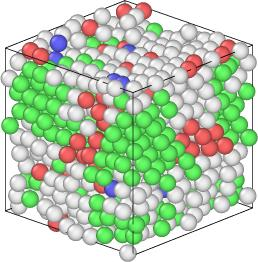
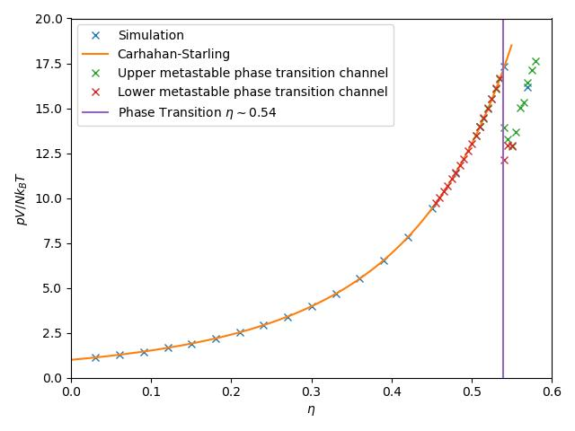

# Event Chain Monte Carlo

This is a simple as possible implementation of the event chain monte carlo
algorithm.

Currently steric interactions between particles of variable size are respected
across a simulation container with periodic boundaries. No fancy optimizations
are used to keep the code simple and easy to understand.

  

